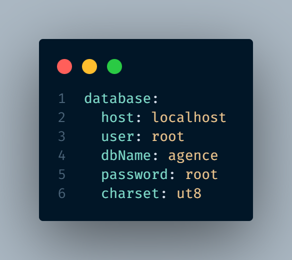

# Projet MVC avec Symfony Yaml et Altorouter

Ce projet implémente une architecture MVC (Modèle-Vue-Contrôleur) avec un `fichier .yaml` pour la gestion de fichiers de configuration et `Altorouter` pour la gestion des routes. Il inclut une gestion de la base de données avec des constantes de connexion stockées dans un fichier YAML.

## Structure du projet

- **config/** : Contient les configurations de l'application.
     - **Routes.yaml** : Définition des routes pour Altorouter.
     - **Constante.yaml** : Constantes de connexion à la base de données.

- **src/** : Contient la logique principale de l'application.
     - **Controller/** : Contient les contrôleurs pour gérer les requêtes et les réponses.
     - **Entity/** : Contient les modèles qui gèrent les données et les intéractions avec la base de donnée.
     - **templates/** : Contient les vues pour afficher les données à l'utilisateur.
     - **Manager.php** : Conteneur d'injection de dépendances entre la connexion à la base donnée et les modèles.
     
- **services/** : Contient la logique principale de l'application.
     - **DataBase.php** :  Classe pour gérer la connexion à la base de données.
     - **LoaderFile.php** : Classe pour charger et gérer les fichiers YAML.
     - **Router.php** : Gère les routes chargées dans le fichier `Routes.yaml` en utilisant Altorouter.

## Installation

### 1. Cloner le projet

Clonez ce repository dans un répertoire local :

1. **Cloner le dépôt**

   ```bash
   git clone https://github.com/Tendry-Rkt56/mvc-routing-yaml.git

2. **Naviguer dans le dossier du projet**

3. **Configuration de la base de données** 

     Modifiez le fichier `config/Constante.yaml` pour y insérer les informations de votre base de données
     

4. **Charger les routes**
    Les routes de l'application sont définies dans le fichier `config/Routes.yaml`. Exemple de contenu
    

5. **Lancer le serveur de développement**
    
   ```bash
   php -S localhost:8000 -t public

## Contributions
Les contributions sont les bienvenues ! Veuillez ouvrir une issue ou soumettre une pull request pour toute amélioration ou correction de bugs.

## Contact
- **Nom** : Tendry Zéphyrin
- **Email** : tendryzephyrin@gmail.com
- **GitHub** : [Tendry-Rkt56](https://github.com/Tendry-Rkt56)
